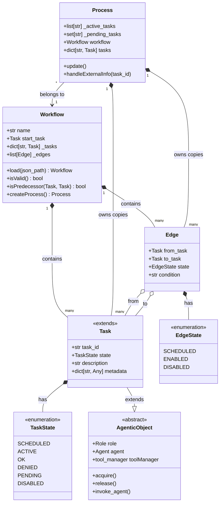
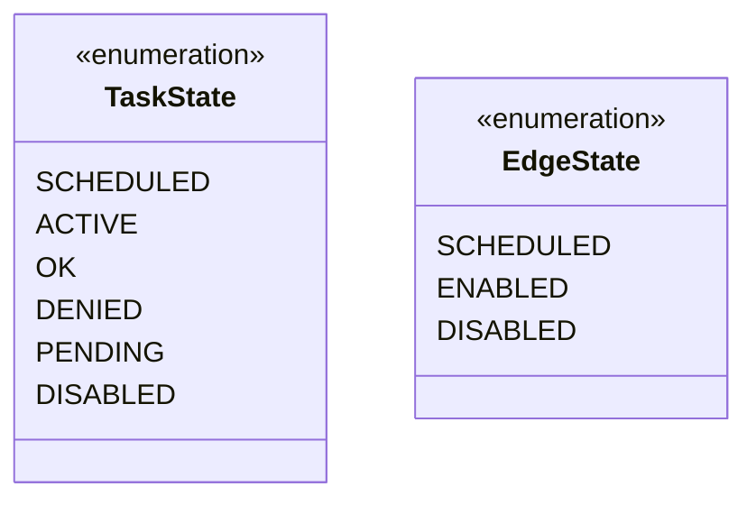
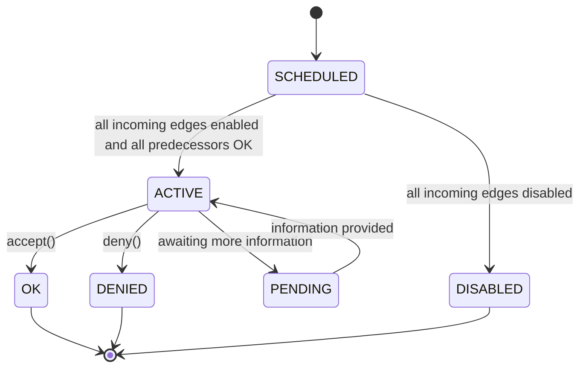

# Agentic Process - Design Document

## Overview

The `agentic_process` application provides a domain model for defining, loading, and executing declarative workflows composed of OAP (Object-Agentic Programming) tasks connected by directed edges. A **Workflow** is a static, validated template loaded from JSON. A **Process** is a runtime instantiation of a Workflow, tracking per-task state and managing task activation through edge traversal.

## Domain Model



## Class Details

### `Workflow`

A `Workflow` is the immutable template for a directed graph of tasks. It is constructed from a JSON file and performs structural validation.

**Members:**
- `name: str` — Human-readable workflow name
- `_tasks: dict[str, Task]` — Task ID to Task instance mapping (the canonical registry)
- `_edges: list[Edge]` — Ordered list of directed edges
- `start_task: Task` — The single root task (no incoming edges)

**Methods:**

- `load(json_path: str) -> Workflow` — Class method. Parses JSON, instantiates Task and Edge objects, returns the constructed Workflow.
- `is_valid() -> bool` — Returns `True` if:
  1. There is exactly one node with in-degree 0 (the start node)
  2. There are no cycles (the graph is a DAG)
  3. Every node is reachable from the start node via directed edges
- `is_predecessor(candidate: Task, descendant: Task) -> bool` — Returns `True` if `candidate` is a direct or indirect predecessor of `descendant` in the DAG (uses DFS/BFS from `candidate`).
- `create_process() -> Process` — Factory. Creates a new `Process` from this Workflow. Each Task in the Process is a fresh instance (not shared with the Workflow or other Processes). Edges are likewise duplicated so the Process is fully independent.

### `Process`

A `Process` is a runtime instance of a Workflow. It owns its own copies of all Tasks and Edges and tracks their lifecycle.

**Members:**
- `process_id: str` — Unique identifier (UUID4)
- `workflow: Workflow` — Reference to the template this Process was created from
- `tasks: dict[str, Task]` — Task ID to the Process's Task instance

**Methods:**

- `get_active_tasks() -> list[Task]` — Filters `tasks` and returns all Tasks in `ACTIVE` state
- `get_pending_tasks() -> list[Task]` — Filters `tasks` and returns all Tasks in `PENDING` state

### `Task`

Extends `AgenticObject`. Each Task is itself an OAP object that can be invoked by an individual agent to perform work.

**Members:**
- `task_id: str` — Unique identifier within the Workflow/Process
- `state: TaskState` — Current lifecycle state
- `description: str` — Human-readable description
- `metadata: dict[str, Any]` — Arbitrary key-value data

**Methods:**

- `accept() -> None` — Decorated with `@tool`. The agent decides the task is successfully completed, transitions state to `OK`, and evaluates the `condition` on each outgoing edge, enabling or disabling them based on whether the condition is met.
- `deny() -> None` — Decorated with `@tool`. The agent decides to deny the process, transitions state to `DENIED`, and disables all outgoing edges.

### `Edge`

A directed connection between two Tasks.

**Members:**
- `from_task: Task` — Source task
- `to_task: Task` — Target task
- `state: EdgeState` — Whether the edge is enabled (agent decides this by evaluating `condition`)
- `condition: str` — The condition label (from the JSON `label` key) that the agent evaluates when the source task completes

### `TaskState`



**States:**
- `SCHEDULED` — Task is part of the Process but has not yet been enabled (not all incoming edges are enabled or not all predecessors are `OK`)
- `ACTIVE` — Task has been enabled and is currently being executed by an agent
- `OK` — Task completed successfully via `accept()`
- `DENIED` — Task was explicitly denied via `deny()`, all downstream edges are disabled
- `PENDING` — Task is actively waiting for input (e.g. more information) before it can proceed
- `DISABLED` — Task cannot proceed because all its incoming edges are disabled

**Edge states:**
- `SCHEDULED` — The predecessor task is not yet finished, edge state is undetermined
- `ENABLED` — The edge condition was met by the agent, the successor task should be activated
- `DISABLED` — The edge condition was not met, downstream tasks will transition to `DISABLED`

## File Format

The actual canvas file format is a JSON with `nodes` and `edges` arrays. Each node represents a task with `id`, `text` (the node label), and optional `color` (terminal/deny states use `"color":"5"`). Edges connect `fromNode` to `toNode` with an optional `label` — this label becomes the edge's `condition` in the application.

Example:

```json
{
  "nodes": [
    { "id": "ffbc51f765e51819", "text": "# Dienstreisegenehmigung liegt vor?", "color": "0" },
    { "id": "2258cdab9dfbed6b", "text": "# Angaben zur Dienstreise liegen vollständig vor?", "color": "0" },
    { "id": "2e013301e3476fae", "text": "Antrag Ablehnen", "color": "5" }
  ],
  "edges": [
    { "fromNode": "ffbc51f765e51819", "fromSide": "top", "toNode": "2e013301e3476fae", "toSide": "bottom", "label": "Nein" },
    { "fromNode": "ffbc51f765e51819", "fromSide": "right", "toNode": "2258cdab9dfbed6b", "toSide": "left", "label": "Ja" }
  ],
  "metadata": { "version": "1.0-1.0", "frontmatter": {} }
}
```

## State Transition Rules



## Design Decisions

1. **Process copies Tasks/Edges from Workflow** — A Workflow is a pure template. Each `create_process()` call produces a Process with its own Task instances. This allows multiple concurrent Processes from the same Workflow without state leakage.

2. **Task extends AgenticObject** — Each Task is a full OAP object, meaning it can have tools, be invoked by agents, and maintain its own internal state via the OAP infrastructure. This is the core of the agentic process model: tasks are not dumb data containers, they are autonomous agents.

3. **Edge `condition` maps to JSON `label`** — The `condition` member on Edge stores the value from the canvas file's `label` key (e.g. "Ja", "Nein"). When a task completes, the agent running that task evaluates the conditions on outgoing edges and enables or disables them accordingly.

4. **Edge states propagate through the graph** — When a successor edge is disabled, the downstream task transitions to `DISABLED` if all its incoming edges are disabled. This propagates through the network until it hits a task with at least one enabled incoming edge.

5. **`is_predecessor` is a Workflow-level method** — Predecessor relationships are defined by the Workflow topology and don't change at runtime. Computing this on the Workflow (not the Process) is correct because the graph structure is invariant across Processes.