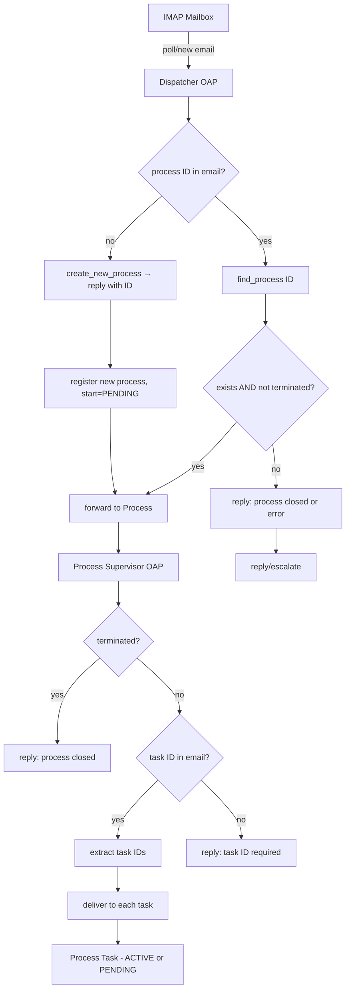

# Agentic Process - Incoming Email Processing

## Overview

The application's entry point (`__main__.py`) currently creates a process directly. The new design replaces this with a main loop that listens for incoming emails and routes them to the appropriate process.

## Email Address Matching

The application listens on an IMAP mailbox. Incoming emails are matched against a configurable suffix pattern. An email addressed to `info+dienstreise@schaeferlist.de` belongs to this application because of the `+dienstreise` suffix.

**Key points:**
- The suffix is configurable via `.env` / `config.py`
- Emails not matching the suffix are silently ignored
- This is the first filter — only emails with the matching suffix enter the routing pipeline

### IMAP Configuration

The IMAP connection uses `imaplib.IMAP4_SSL` with credentials from `config.py` (`IMAP_HOST`, `IMAP_PORT`, `IMAP_USERNAME`, `IMAP_PASSWORD`, `IMAP_FOLDER`). The existing `email_client.py` module provides two functions that the dispatcher will reuse:

- **`search_emails(folder, subject_regex)`** — opens a new IMAP connection, logs in, searches for UNSEEN messages, optionally filters by subject regex, and returns a list of message UIDs. Closes the connection after use.
- **`fetch_email(uid, folder, attachments_dir)`** — opens a new IMAP connection, logs in, fetches a single message by UID via `(RFC822)`, parses it into an `EmailInfo` dataclass (from_addr, subject, body_text, attachments), and saves any attachments to disk. Closes the connection after use.

Each operation opens and closes its own connection — there is no persistent connection pool.

### IMAP Connection Error Handling

If the IMAP connection fails, the main loop retries up to **3 times** with a **5-second delay** between attempts. After 3 failed attempts, the program exits with the error message from the last connection attempt.

### Design Notes

The suffix could be stored in `apps/agentic_process/config.py` alongside existing SMTP config, e.g.:

```python
# config.py
EMAIL_SUFFIX: str = os.getenv("PETEOS_AGENTIC_PROCESS_SUFFIX", "dienstreise")
```

## New Agentic Object: Email Dispatcher

A new OAP class is needed that acts as the entry point for all incoming emails. This object is responsible for:

1. Receiving each incoming email
2. Deciding whether the email belongs to an existing process or requires a new one
3. Forwarding the email to the appropriate process (or creating a new process and forwarding)

### Agent Responsibilities

The dispatcher agent's system prompt instructs it to take incoming emails and decide whether to create a new process or route to an existing one. The agent uses tools to make this determination.

### System Prompt

The dispatcher agent's system prompt instructs it to:
1. Parse the incoming email (user text)
2. Search for a process ID in the email content or subject line
3. Apply the routing logic below in priority order

### Routing Logic

The dispatcher must distinguish between exactly four situations, applied in this priority order:

1. **Process exists and has remaining tasks** — A process ID was found in the email (subject or body) and `find_process` returns a matching process where `process.is_terminated()` returns `False`. The email is forwarded to that existing process.

2. **Process exists but is terminated** — A process ID was found but all tasks in the process are already done. The dispatcher replies to the user that the process is closed.

3. **Process ID found but does not exist** — A process ID was extracted from the email but `find_process` returns `None`. This is an error condition: the email content is forwarded to the configured escalation email address with an explanation that the referenced process was not found.

4. **No process ID found — create new process** — No process ID is present in the email. A new process is created from the default workflow via `create_new_process`, which returns the new process ID. The dispatcher replies to the user with the new process ID, then forwards the email to the Process Supervisor to deliver to the (only) pending start task.

## Process Supervisor

After the dispatcher routes an email to an existing process (or creates a new one), the email must reach the correct pending task(s) inside the process. This requires a second OAP object: the **Process Supervisor**.

### Agent Responsibilities

The process supervisor agent receives forwarded emails and decides which pending task(s) should handle the email content.

### Routing Logic for Task-Level Distribution

The supervisor applies the following logic:

1. **Process is terminated** — `process.is_terminated()` returns `True`. The supervisor replies to the user that the process is closed.

2. **Task ID extracted from email** — The email contains a specific task ID (provided by the task agent when it sent its request to the user). Route the email to that exact task.

3. **Multiple task IDs extracted** — The user replied to requests from multiple task agents in one email. Route the email to **all** identified tasks. Each task receives the email independently.

4. **No task ID extracted** — The supervisor replies to the user that the email cannot be associated with the right task in the process because the task ID was not provided. This is the simplest approach for now; agentic systems may be more capable later.

### Multiple Task Delivery

When multiple task IDs are extracted, tasks are invoked **sequentially** (not concurrently). The sequence continues until all tasks are handled or a failure stops the chain:

- **Agent accepts** — The task processes the email successfully. Continue to the next pending task.
- **Agent denies** — The entire process is denied. An escalation email is sent to the configured escalation address so a human supervisor can review whether the denial was correct.
- **System failure** (exception, crash) — The chain stops immediately. This is a prototypic implementation, so simplicity is prioritized.

### Email Conventions

- When a task agent sends a request to the user, it always includes its task ID in the request.
- Replies from the user should contain the process ID and task ID in the subject line.
- The supervisor agent parses the email to extract process ID and task ID(s).

### Process Supervisor Class: `ProcessSupervisor`

```python
# apps/agentic_process/supervisor.py (stub)

from peteos.oap.base import AgenticObjectBase


class ProcessSupervisor(AgenticObjectBase):
    """OAP object that routes incoming emails to the correct
    pending task(s) within a process."""

    def __init__(self, app_main, process_id: str):
        """Initialize with the AppMain instance and the target process ID."""
        pass

    # --- Tools available to the agent running the supervisor ---

    def get_email_subject(self, uid: str) -> str:
        """Fetch the subject line of the email with the given IMAP UID."""
        ...

    def get_email_body(self, uid: str) -> str:
        """Fetch the body text of the email with the given IMAP UID."""
        ...

    def is_terminated(self) -> bool:
        """Check if the process is terminated (all tasks are done)."""
        ...

    def get_pending_tasks(self, process_id: str) -> list[dict]:
        """List all pending tasks for a given process.
        Loads the process from disk if not in cache.
        """
        ...

    def extract_task_ids(self, uid: str) -> list[str]:
        """Extract task IDs from the email using the PROCESS_ID/TASK_ID format.
        Returns a list of task IDs found, possibly empty.
        """
        ...

    def deliver_to_task(self, process_id: str, task_id: str, uid: str) -> None:
        """Get the task agent from the process via app_main and invoke it
        with the email UID. The task agent reads the email via the UID.
        Uses the task's persistent thread ID: process_id/task_id.
        """
        ...

    def reply_to_user(self, uid: str, subject: str, body: str) -> None:
        """Send a reply to the email with the given UID."""
        ...

    def escalate(self, uid: str, reason: str) -> None:
        """Forward the email to the escalation address with an error note."""
        ...
```

## Process Initialization

### Start State

A new process should **not** start with the start task in `ACTIVE` state. Instead, it should start with the start task in `PENDING` state. This ensures:

- The first email clearly goes to the start task (it is the only pending task)
- No agent needs to manually activate the start task — the email arrival itself triggers it
- The transition `PENDING -> ACTIVE` is implicit when the first email arrives

### Process Supervisor Integration

The dispatcher and supervisor work together as a pipeline:

```
Dispatcher routes to process ──> Process Supervisor distributes to task(s)
```

When the dispatcher creates a new process, it passes the email to the supervisor, which then routes it to the (only) pending start task.

## Invocation and Forwarding Mechanism

### Three-Level Recursion

The email processing follows a fixed three-level invocation chain:

```
Main loop → Dispatcher OAP → Process Supervisor OAP → Task OAP
```

This recursion is bounded — it never exceeds three levels. Each level invokes the next via tool calls, and the email UID is threaded through the chain.

### Invocation Per Level

**Level 1 — Main loop invokes Dispatcher:**

The main loop fetches one email from IMAP and invokes the dispatcher via `invoke()` with a **non-persistent session** (no thread ID). The static prompt instructs the dispatcher to parse the email and make a routing decision. The dispatcher agent accesses email content (subject, body) via its tools using the IMAP UID.

**Level 2 — Dispatcher invokes Process Supervisor:**

After the dispatcher routes the email to a process (existing or newly created), it invokes the process's `ProcessSupervisor` via `invoke()` with a **non-persistent session** (no thread ID). The supervisor determines which task(s) handle the email.

**Level 3 — Supervisor invokes Task:**

The supervisor invokes the target task's agent via `invoke()` with the task's **persistent thread ID** (`process_id/task_id`), passing the email UID. The task agent processes the email content.

### Email UID Threading

The IMAP UID is threaded through the entire invocation chain as the handle to identify the email being processed. When the process supervisor receives the UID, it downloads the full email (including attachments) from the IMAP server and caches it on disk in the process's subdirectory at `{process_dir}/emails/{uid}/`. Subsequent task agents read the email and its attachments from disk using the UID — no redundant IMAP fetches.

**UID recycling caveat:** IMAP UIDs can be recycled after mail deletion. For now, emails are not deleted, so this is not a concern.

### Application Main Class: `AppMain`

The application is orchestrated by a central `AppMain` class. This class owns:

- The process registry: `dict[process_id, Process]` mapping
- The IMAP connection
- The workflow path
- The escalation email address

It provides a unified interface for process lifecycle and agent access. Key method and attribute:

```python
def get_or_create_supervisor(self, process_id: str) -> ProcessSupervisor:
    """Get the ProcessSupervisor for a process.
    Returns the cached supervisor if it exists. Otherwise, loads the
    process from disk (or creates it if it doesn't exist), then
    returns a fresh supervisor for that process."""
    ...

def create_process_from_workflow(self) -> str:
    """Create a new process from the workflow loaded at startup.
    Returns the new process ID. Called by the dispatcher when no
    process ID was found in the email."""
    ...
```

`self.dispatcher: EmailDispatcher` is set once at `AppMain` initialization and accessed directly by the main loop.

### Thread ID Policy

- **Task agents have persistent thread IDs** — The thread ID for a task agent is `process_id/task_id` (the same format used in emails). This ensures session continuity across invocations. The task OAP object is always invoked with its thread ID.
- **Supervisor agents do NOT have persistent thread IDs** — The ProcessSupervisor OAP object is invoked without a thread ID (non-persistent session) each time the dispatcher routes an email. The supervisor object persists, but its session is ephemeral.
- **Dispatcher agents do NOT have persistent thread IDs** — The dispatcher OAP object is invoked without a thread ID (non-persistent session) each time the main loop processes an email. The dispatcher object persists, but its session is ephemeral.

### Class: `EmailDispatcher` (name TBD)

```python
# apps/agentic_process/dispatcher.py (stub)

from peteos.oap.base import AgenticObjectBase


class EmailDispatcher(AgenticObjectBase):
    """OAP object that receives incoming emails and routes them
    to existing or newly created processes."""

    def __init__(self, app_main):
        """Initialize with the AppMain instance, which provides access to
        the process registry and supervisor creation."""
        pass

    # --- Tools available to the agent running this dispatcher ---

    def get_email_subject(self, uid: str) -> str:
        """Fetch the subject line of the email with the given IMAP UID."""
        ...

    def get_email_body(self, uid: str) -> str:
        """Fetch the body text of the email with the given IMAP UID."""
        ...

    def find_process(self, process_id: str) -> dict | None:
        """Find a specific process by ID via the app_main registry."""
        ...

    def create_new_process(self, uid: str) -> str:
        """Create a new process via app_main.create_process_from_workflow().
        Returns the new process ID.
        """
        ...

    def reply_to_user(self, uid: str, subject: str, body: str) -> None:
        """Send a reply to the email with the given UID.
        Used to communicate the new process ID to the user after case 4.
        """
        ...

    def escalate(self, uid: str, reason: str) -> None:
        """Forward the email to the escalation address with an error note."""
        ...

    def forward_email(self, process_id: str, uid: str) -> None:
        """Forward the incoming email to the given process.
        1. Call app_main.get_or_create_supervisor(process_id) to get a supervisor.
        2. Invoke the supervisor agent via supervisor.invoke() with (process_id, uid).
           The supervisor agent decides which task(s) handle the email.
        """
        ...
```

### Data Flow



## Responsibilities

| Entity | Responsibility |
|---|---|
| **AppMain** | Central orchestrator: owns process registry, IMAP connection, workflow config, escalation email address; provides `get_or_create_supervisor` and `dispatcher` |
| **Main loop** (`__main__.py`) | Poll IMAP mailbox, invoke `app_main.dispatcher`, invoke `app_main.get_or_create_supervisor(process_id)` |
| **Email Dispatcher OAP** | Receive email, route to process (existing or new) |
| **Process Supervisor OAP** | Receive forwarded email, distribute to correct pending task(s) |
| **Process** | Track pending tasks, consume email content at task level |
