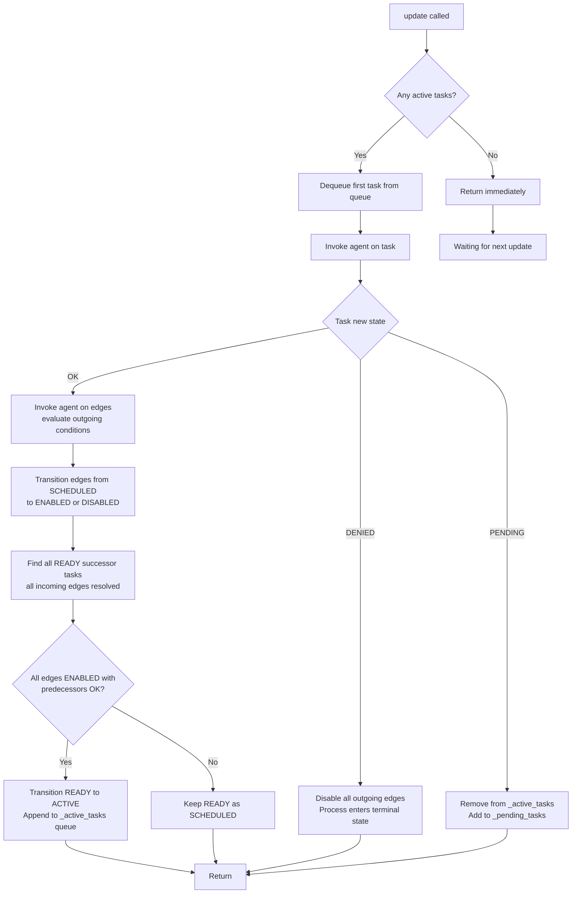
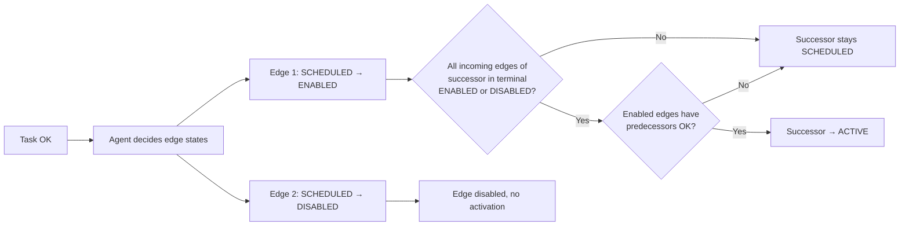
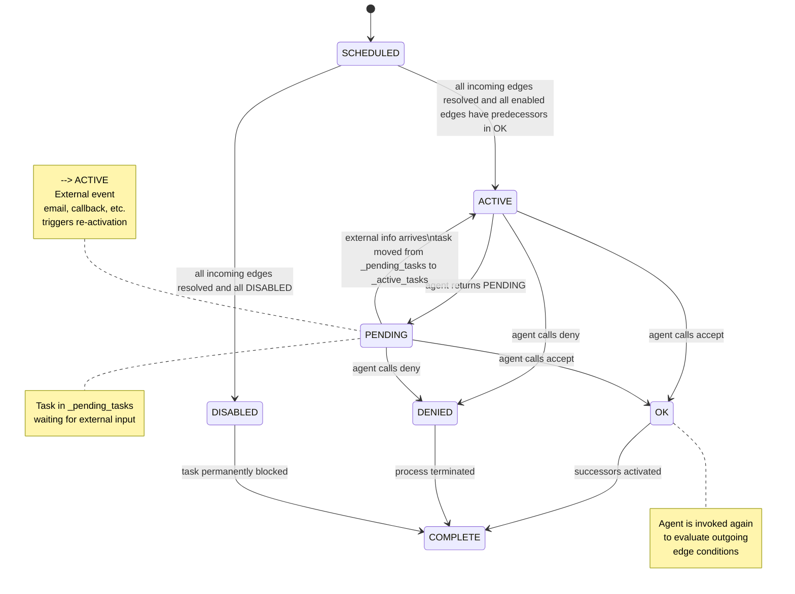
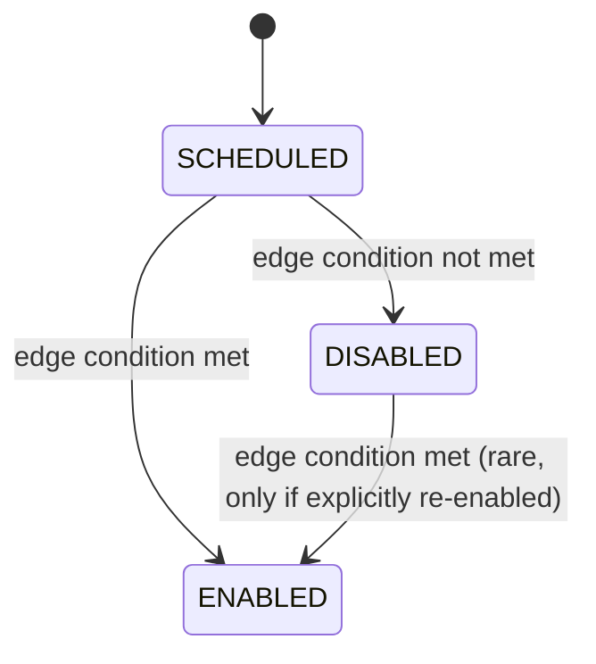

# Process Engine - Algorithm

## Overview

The **Process Engine** drives a runtime Process forward through its Workflow by iteratively invoking agents on active tasks and propagating state changes through the graph. Unlike a traditional state machine with a single active state, multiple tasks can be ACTIVE concurrently. The engine maintains a queue of active task IDs and processes them one at a time per invocation.

## Core Data Structures

**`_active_tasks: list[str]`** — Ordered queue of active task IDs. The engine dequeues from the front and appends to the back. A task is removed when it reaches a terminal state (`OK`, `DENIED`, `DISABLED`).

**`_pending_tasks: set[str]`** — Set of pending task IDs. This is the lookup index for external events (email, API callback, etc.). When external information arrives for a pending task, its ID is moved from `_pending_tasks` to `_active_tasks` so the engine picks it up on the next `update()`.

## Update Cycle



### Step-by-step

1. **Check for active tasks** — If `_active_tasks` is empty, the process has no work and returns immediately.
2. **Dequeue one active task** — Pop the first task ID from `_active_tasks`. Only one task is processed per `update()` call.
3. **Invoke the agent** — The task is an OAP object (`AgenticObject`). Calling `invoke()` on it launches the agent with the task's tools and state.
4. **Handle the result** — The agent's tools (`accept`, `deny`, `set_text`, etc.) determine the task's new state:
   - **`PENDING`** — The task awaits external input (e.g., an email was sent to a user). The task is removed from `_active_tasks` and added to `_pending_tasks`.
   - **`DENIED`** — The process is terminated. All outgoing edges are disabled.
   - **`OK`** — The task completed successfully. Proceed to edge evaluation.

## Edge Evaluation

When a task reaches `OK`, the engine invokes the agent on that task again to evaluate edge conditions. Each edge starts in `SCHEDULED` state (condition undetermined) and the agent transitions it to `ENABLED` or `DISABLED`.

There is one exception: when a task transitions to `DISABLED`, all of its outgoing edges are automatically set to `DISABLED` by the engine without agent evaluation. A disabled task cannot activate any successors.

1. **Agent evaluates outgoing edges** — For each outgoing edge, the agent determines whether the `condition` (from the JSON `label`) is satisfied.
2. **Transition edges from `SCHEDULED`** — The engine updates each edge's state to `ENABLED` or `DISABLED` based on the agent's decision.
3. **Find all READY successor tasks** — A task is READY when all of its incoming edges are in a terminal state (`ENABLED` or `DISABLED`) but the task itself is still `SCHEDULED`.
4. **Transition READY to ACTIVE** — For each READY task, if all enabled edges have their predecessors in `OK` state, transition the task from `SCHEDULED` to `ACTIVE` and append its ID to `_active_tasks`.



## Task Activation

A task transitions from `SCHEDULED` to `ACTIVE` **if and only if** both of the following conditions hold:

1. **All incoming edges are resolved** — Every incoming edge of the task is in a terminal state (`ENABLED` or `DISABLED`). No incoming edge may be `SCHEDULED`.
2. **Enabled edges point to finished predecessors** — For every incoming edge that is `ENABLED`, its `from_task` must be in `OK` state.

If any incoming edge is still `SCHEDULED`, the task remains `SCHEDULED` and waits. This prevents premature activation: a task with two predecessors cannot activate until *both* predecessors have finished and *both* edges have been evaluated by their respective agents.

If all incoming edges are `DISABLED`, the task transitions to `DISABLED` (see [Task Lifecycle](#task-lifecycle)).

## Task Lifecycle



## Edge State Transitions



## Termination Conditions

A process reaches a terminal state when any of the following occur:

1. **`DENIED`** — An agent calls `deny()` on any active task. The process halts immediately.
2. **All tasks terminal** — Every task is in `OK`, `DENIED`, or `DISABLED`. No active tasks remain.
3. **Deadlock** — Active tasks exist but cannot progress (e.g., all in `PENDING` indefinitely). This is not automatically detected; it requires an external timeout or heartbeat mechanism.

## Example Flow

Given a workflow: `start → review → approve → complete`

```
Round 1:
  _active_tasks = [start]
  update() → pop "start", invoke agent
  Agent calls accept()
  start state: SCHEDULED → OK
  Agent evaluates edges: start→review → ENABLED
  Precondition check: review's only incoming edge is ENABLED, start is OK ✓
  review state: SCHEDULED → ACTIVE
  _active_tasks = [review]

Round 2:
  _active_tasks = [review]
  update() → pop "review", invoke agent
  Agent calls accept()
  review state: ACTIVE → OK
  Agent evaluates edges: review→approve → ENABLED
  Precondition check: approve's only incoming edge is ENABLED, review is OK ✓
  approve state: SCHEDULED → ACTIVE
  _active_tasks = [approve]

Round 3:
  _active_tasks = [approve]
  update() → pop "approve", invoke agent
  Agent calls accept()
  approve state: ACTIVE → OK
  Agent evaluates edges: approve→complete → ENABLED
  Precondition check: complete's only incoming edge is ENABLED, approve is OK ✓
  complete state: SCHEDULED → ACTIVE
  _active_tasks = [complete]

Round 4:
  _active_tasks = [complete]
  update() → pop "complete", invoke agent
  Agent calls accept()
  complete state: ACTIVE → OK
  No outgoing edges
  _active_tasks = []

Round 5:
  _active_tasks is empty → return, process complete
```

## Concurrency Example

Given a workflow: `start → task_a → end_a` and `start → task_b → end_b`

```
Round 1:
  _active_tasks = [start]
  update() → pop "start", invoke agent
  start → OK
  Both edges enabled: start→task_a, start→task_b
  Both predecessors OK ✓
  task_a → ACTIVE, task_b → ACTIVE
  _active_tasks = [task_a, task_b]

Round 2:
  _active_tasks = [task_a, task_b]
  update() → pop "task_a", invoke agent
  task_a → OK
  task_a→end_a enabled, end_a → ACTIVE
  _active_tasks = [task_b, end_a]

Round 3:
  _active_tasks = [task_b, end_a]
  update() → pop "task_b", invoke agent
  task_b → OK
  task_b→end_b enabled, end_b → ACTIVE
  _active_tasks = [end_a, end_b]

Round 4:
  _active_tasks = [end_a, end_b]
  update() → pop "end_a", invoke agent
  end_a → OK
  _active_tasks = [end_b]

Round 5:
  _active_tasks = [end_b]
  update() → pop "end_b", invoke agent
  end_b → OK
  _active_tasks = []
```

## Convergent Example

Given a workflow: `task_a → join ← task_b` where `join` has two incoming edges.

```
Round 1:
  _active_tasks = [task_a, task_b]
  update() → pop "task_a", invoke agent
  task_a → OK
  task_a→join → ENABLED
  Precondition: join has 2 incoming edges, but task_b→join is still SCHEDULED ✗
  join stays SCHEDULED
  _active_tasks = [task_b]

Round 2:
  _active_tasks = [task_b]
  update() → pop "task_b", invoke agent
  task_b → OK
  task_b→join → ENABLED
  Precondition: join's incoming edges are now [ENABLED, ENABLED] — both resolved
  Both predecessors are OK ✓
  join state: SCHEDULED → ACTIVE
  _active_tasks = [join]

Round 3:
  _active_tasks = [join]
  update() → pop "join", invoke agent
  join → OK
  _active_tasks = []
```

This demonstrates the key semantics: `join` could not activate until **all** incoming edges left the SCHEDULED state, even though `task_a` finished first.